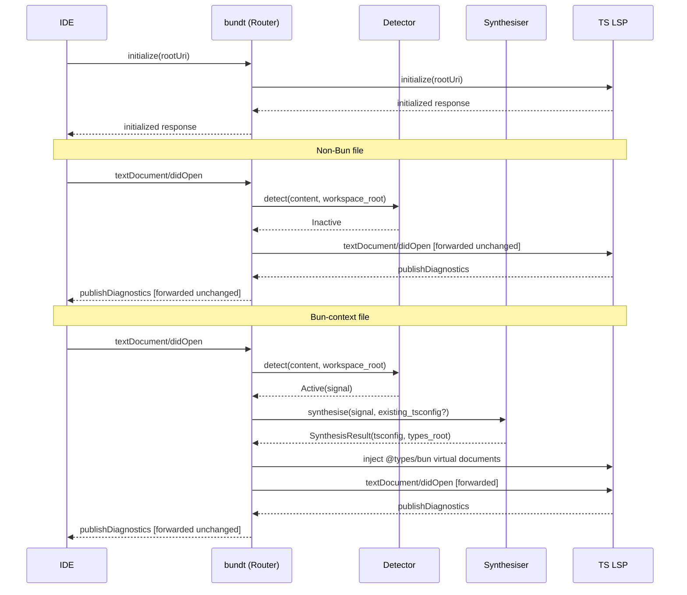

# Architecture

High-level design for the `bundt` system. Lower-level component docs live in `design/`. Per-release design docs will live alongside their implementation.

---

## Components

```
┌──────────────────────────────────────────────┐
│           IDE (Zed, VS Code, …)              │
│                                              │
│  ┌───────────────────────────────────────┐   │
│  │         editor extension              │   │  (separate repo per IDE)
│  │  e.g. bundt-zed                       │   │
│  │  - downloads / bundles binaries       │   │
│  │  - registers as TS/JS LSP             │   │
│  │  - surfaces debug commands            │   │
│  └──────────────┬────────────────────────┘   │
└─────────────────│────────────────────────────┘
                  │ JSON-RPC over stdio
                  ▼
┌────────────────────────────────────────┐
│               bundt                    │  (this repo)
│                                        │
│  ┌──────────────┐  ┌────────────────┐  │
│  │  Detector    │  │  Synthesiser   │  │
│  │              │  │                │  │
│  │  shebang     │  │  virtual       │  │
│  │  bun import  │  │  tsconfig      │  │
│  │  bun.lockb   │  │  + @types/bun  │  │
│  └──────┬───────┘  └───────┬────────┘  │
│         │                  │           │
│  ┌──────▼──────────────────▼────────┐  │
│  │            Router                │  │
│  │                                  │  │
│  │  Bun context → inject + forward  │  │
│  │  No Bun context → forward only   │  │
│  └──────────────────┬───────────────┘  │
└─────────────────────│──────────────────┘
                      │ JSON-RPC over stdio
                      ▼
          ┌───────────────────────┐
          │   TS LSP subprocess   │
          │  (typescript-language-server or similar)   │
          └───────────────────────┘
```

### Editor extension (e.g. bundt-zed)

A per-IDE shim responsible for packaging and launching `bundt`, registering it as the LSP for TypeScript/JavaScript files, and exposing debug commands. Each IDE gets its own extension repo with its own release cycle. `bundt-zed` is the first; others (VS Code, etc.) would follow the same pattern.

**Does not** implement any LSP logic. It is a thin shim.

### bundt — Detector

Reads the opened file and workspace root to decide whether Bun context applies. Produces a `Detection` result: either inactive (pass through) or active with the triggering signal (shebang, import, or lockfile).

### bundt — Synthesiser

Given a `Detection` result and an optional on-disk `tsconfig.json`, produces a complete in-memory `tsconfig.json`. Merges with any existing on-disk config rather than replacing it. Also holds the vendored `@types/bun` declaration bytes at a pinned version.

### bundt — Router

The core message loop. Reads JSON-RPC from the IDE, asks the Detector whether Bun context is active, calls the Synthesiser when needed, and writes to the downstream TS LSP. Replies from the TS LSP are forwarded back to the IDE unchanged.

### TS LSP subprocess

The real TypeScript LSP — `typescript-language-server` by default, but configurable. Launched as a child process by `bundt`. Receives all JSON-RPC traffic, either verbatim (non-Bun) or with injected config (Bun). `bundt` has no knowledge of TypeScript semantics — it defers entirely to the downstream LSP.

---

## Message flow

Two representative flows: a non-Bun file (transparent passthrough) and a Bun-context file (detect → synthesise → inject → forward).



---

## Contracts

### IDE ↔ bundt

Standard LSP over JSON-RPC on stdin/stdout. `bundt` is a drop-in replacement for any TypeScript LSP from the IDE's perspective — it accepts the same protocol and must not change observable LSP behaviour for non-Bun files.

### bundt ↔ TS LSP subprocess

Standard LSP over JSON-RPC on stdin/stdout. `bundt` is a client of the downstream TS LSP (`typescript-language-server` by default). The only modifications `bundt` makes to the message stream are:

- Augmenting `initialize` with the synthesised tsconfig project info (Bun context only).
- Injecting virtual document content for `@types/bun` declarations (Bun context only).

All other messages are forwarded byte-for-byte in both directions.

### Editor extension ↔ bundt

The extension launches `bundt` as a subprocess and communicates solely via the IDE ↔ bundt JSON-RPC channel above. There is no private protocol between the two. The only coupling is a **minimum `bundt` version** declared by each extension release.

### Debug protocol (v0.3)

Custom LSP workspace commands exposed by `bundt`:

- `bundt/virtualConfig` — returns the synthesised tsconfig as sent to the TS LSP for the active file.
- `bundt/detectionInfo` — returns the triggering signal and resolved workspace root.

These are additive. They have no effect on the standard LSP message flow.

---

## Invariants

**No disk writes.** `bundt` never creates, modifies, or deletes files in the user's workspace. All synthesis happens in memory.

**Transparent for non-Bun files.** When the Detector returns inactive, every byte sent by the IDE reaches the downstream TS LSP unchanged and every byte from the TS LSP reaches the IDE unchanged. `bundt` must not alter latency, ordering, or content for non-Bun traffic.

**Vendored types.** `@types/bun` is embedded in the binary at a pinned version. `bundt` never performs network I/O or reads `node_modules` to resolve Bun types.

**TS LSP is authoritative.** `bundt` does not implement TypeScript semantics. Any LSP response that contains type information comes from the downstream TS LSP. `bundt` only shapes the inputs.

**Merge, don't replace.** When an on-disk `tsconfig.json` exists, the synthesised config extends it. Project-specific compiler options are preserved.

**Single activation signal per file.** The Detector evaluates signals in priority order (shebang > import > lockfile) and returns the first match. Only one signal is active per detection result.
